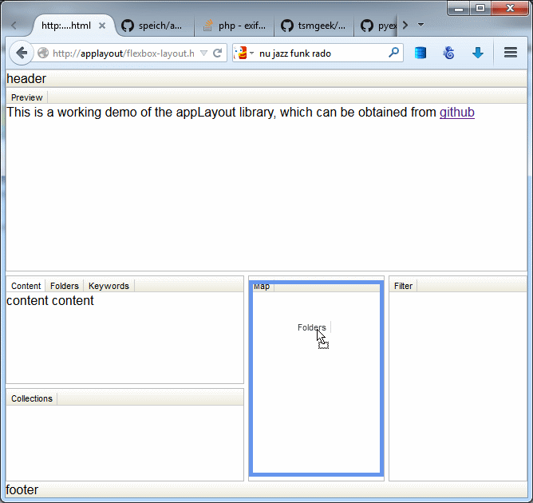
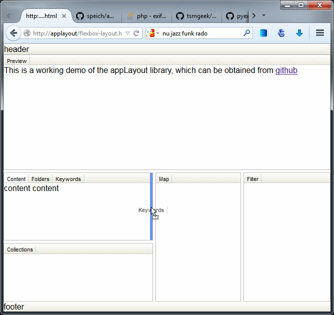
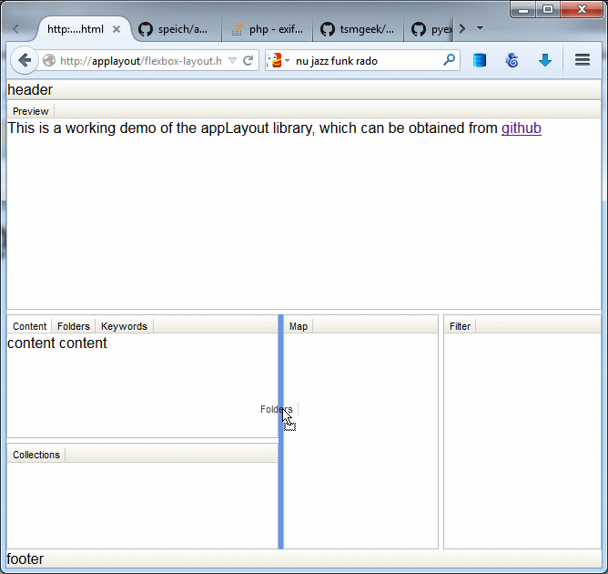

appLayout
=========

A flexbox based application layout, where the content panes can be resized and reordered with drag and drop.

Demo available on [speich.net](http://www.speich.net/projects/programming/flexbox-layout.html)

Drag and drop tab onto another tab:

Drag and drop tab onto divider:

Drag and drop tab onto overlay:

For more information read my [article about flexbox layout](https://hacks.mozilla.org/2013/12/application-layout-with-css3-flexible-box-module/) on hacks.mozilla.org.