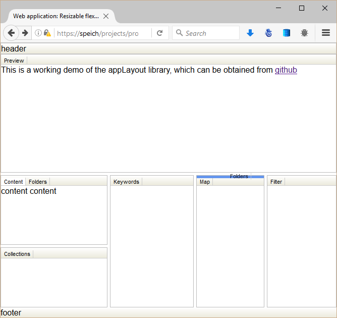

appLayout
=========

A flexbox based application layout, where the content panes can be resized and reordered with drag and drop.
Note: Vertical containers can only be split horizontally, whereas horizontal containers only vertically.

Demo available on [speich.net](http://www.speich.net/projects/programming/flexbox-layout.html)

Drag and drop tab onto another tab (add):

Drag and drop tab onto vertical overlay (split):

Drag and drop tab onto horizontal overlay (split):

Drag and drop tab onto vertical divider (split):

For more information read my [article about flexbox layout](https://hacks.mozilla.org/2013/12/application-layout-with-css3-flexible-box-module/) on hacks.mozilla.org.

Requires dojo.js and NodeList-traverse.js